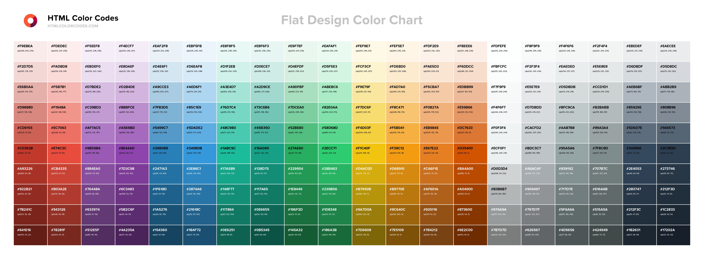
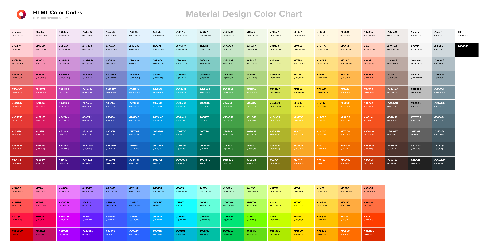
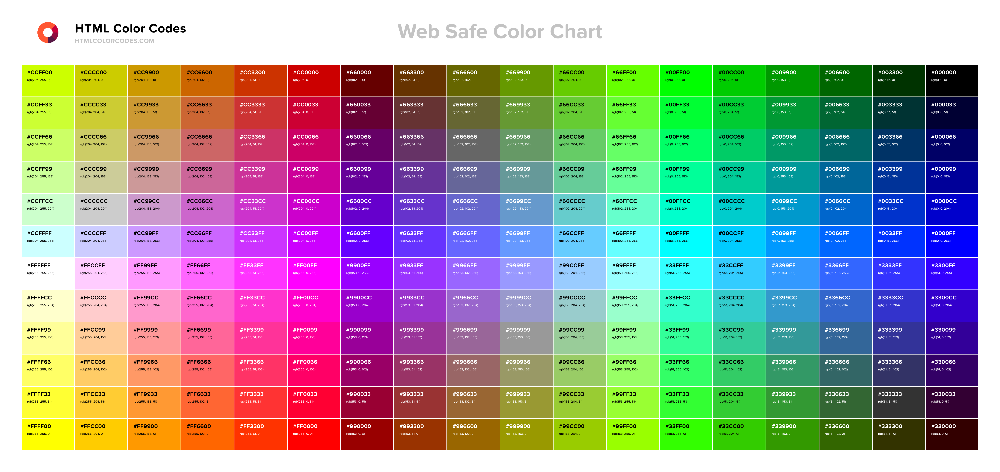

# **Colores**
> *Colores para utilizar en desarrollo de código de [HTML COLOR CODES](https://htmlcolorcodes.com/es/).*
### **Colores Diseño Plano:** 
### **Colores Diseño de Materiales:** 
### **Colores Diseño Web:** 
